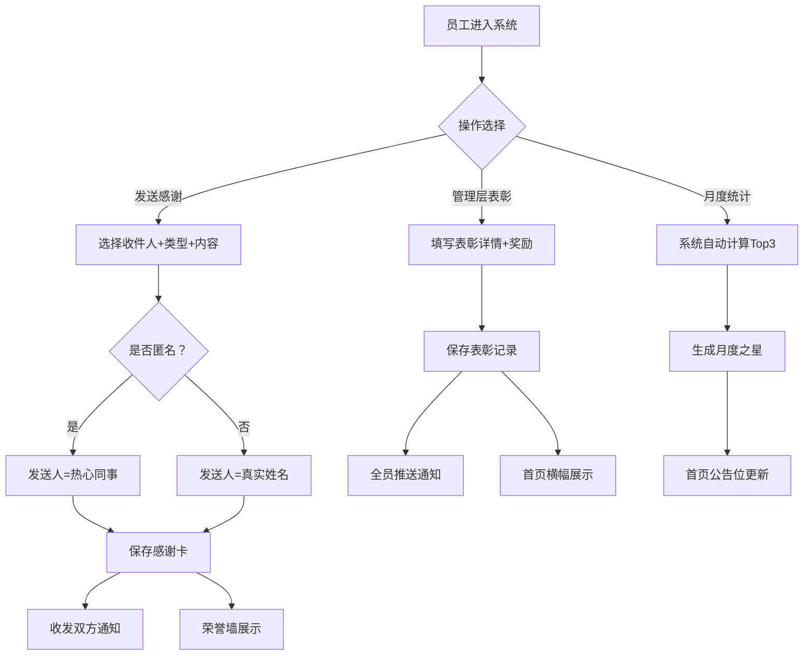

## 1. 产品概述

员工内部表彰与荣誉墙系统是一个面向企业内部的员工激励与认可平台。通过数字化的"感谢卡"和"正式表彰"机制，构建透明、温暖的团队文化，让每一位员工的贡献都被看见和记录。

- 核心价值：打造正向激励的团队文化，促进跨部门协作，辅助HR进行科学的绩效评估
- 目标用户：企业全体员工（普通员工、管理层、HR）
- 核心场景：日常协作感谢、月度之星评选、正式表彰授予、个人成就记录、HR数据洞察

## 2. 核心功能

### 2.1 用户角色

| 角色 | 登录方式 | 核心权限 |
|------|----------|----------|
| 普通员工 | 用户切换模拟 | 发送/接收感谢卡、查看荣誉墙、查看个人主页、匿名发送 |
| 管理层 | 用户切换模拟 | 普通员工全部权限 + 发起正式表彰（带奖金/实物奖励说明） |
| HR | 用户切换模拟 | 普通员工全部权限 + 查看感谢数据统计、辅助绩效评估分析 |

### 2.2 功能模块

1. **首页荣誉墙**：月度之星公告位、最新感谢卡瀑布流、最新正式表彰展示、筛选功能
2. **发送感谢卡**：选择收件人、感谢类型、内容填写、匿名模式开关
3. **正式表彰（管理层）**：选择表彰对象、表彰等级、奖励说明、全员推送
4. **个人主页**：收到的感谢卡、发出的感谢卡、表彰记录、成就徽章、数据统计
5. **HR数据中心**：团队感谢热力图、员工贡献度排名、不善表达员工识别、绩效辅助看板
6. **通知中心**：感谢卡收发通知、表彰通知、月度之星通知

### 2.3 页面详情

| 页面名称 | 模块名称 | 功能描述 |
|-----------|-------------|---------------------|
| 首页荣誉墙 | 月度之星公告位 | 自动展示当月被感谢最多的员工（Top3），含头像、感谢次数、金句展示 |
| 首页荣誉墙 | 感谢卡瀑布流 | 卡片式展示所有公开感谢卡，支持按类型/时间筛选，显示感谢类型标签 |
| 首页荣誉墙 | 正式表彰展示区 | 横幅式展示管理层发起的正式表彰，突出奖励说明 |
| 发送感谢卡 | 收件人选择 | 员工列表搜索选择，支持多部门筛选 |
| 发送感谢卡 | 感谢类型 | 协作互助、解决难题、超越期待、导师指导、创新贡献5种类型 |
| 发送感谢卡 | 匿名开关 | 切换是否公开姓名，匿名时显示"热心同事" |
| 正式表彰页面 | 表彰表单 | 表彰标题、表彰对象、表彰等级（金/银/铜）、奖励类型（奖金/实物）、详细说明 |
| 个人主页 | 成就头部 | 头像、姓名、部门、入职时间、感谢总数、成就徽章 |
| 个人主页 | 感谢卡Tab | 分Tab展示收到/发出的感谢卡，支持展开详情 |
| 个人主页 | 表彰记录 | 时间线展示获得的正式表彰 |
| HR数据中心 | 贡献度排行榜 | 按收到感谢数排名，显示部门分布 |
| HR数据中心 | 不善表达识别 | 识别"收到多但发出少"的员工，辅助绩效评估 |
| HR数据中心 | 类型分布统计 | 各感谢类型占比饼图、部门间感谢网络图 |
| 通知中心 | 通知列表 | 分类展示未读/已读通知，支持一键已读 |

## 3. 核心流程

### 3.1 发送感谢卡流程
员工A选择同事B → 选择感谢类型（如协作互助）→ 填写感谢内容 → 可选匿名 → 提交系统 → 系统向B发送通知 → 感谢卡展示在荣誉墙 → A和B的个人主页均更新记录

### 3.2 管理层表彰流程
管理层登录 → 进入正式表彰页面 → 填写表彰对象、等级、奖励详情 → 提交 → 系统向全员推送通知 → 表彰横幅在首页展示 → 表彰对象个人主页新增勋章

### 3.3 月度之星生成流程
每月1日零点 → 系统统计上月所有感谢卡数据 → 按员工聚合被感谢次数 → 取Top3生成月度之星 → 更新首页公告位 → 向全员推送喜讯通知

### 3.4 流程图

## 4. 用户界面设计

### 4.1 设计风格
- **设计基调**：温暖、典雅、有仪式感的企业级SaaS风格，区别于冰冷的工具类产品
- **主色调**：采用「香槟金」作为主色（#C9A961），象征荣誉与认可；搭配「墨玉绿」（#1A3C34）作为深色点缀
- **辅助色**：暖米白背景（#FAF8F3）、浅金色边框、柔粉渐变卡片（匿名感谢卡用淡紫渐变）
- **按钮样式**：圆角8px，主按钮为金色渐变，hover有微妙的光晕效果
- **字体方案**：标题使用「Noto Serif SC」衬线字体增强仪式感，正文使用「PingFang SC」系统字体保证可读性
- **布局风格**：顶部导航栏 + 左侧可折叠功能菜单 + 右侧内容区；卡片大量使用圆角、阴影和微妙的金边
- **图标风格**：Lucide图标统一使用金色描边，重要节点使用拟物化的勋章/奖章图形

### 4.2 页面设计概览

| 页面名称 | 模块名称 | UI风格描述 |
|-----------|-------------|-------------|
| 首页荣誉墙 | 月度之星公告位 | 顶部大幅横幅，香槟金渐变背景，三强并列，配有皇冠/奖杯emoji装饰 |
| 首页荣誉墙 | 感谢卡瀑布流 | Masonry多列布局，每张卡片有不同的温暖色调渐变，悬停时有上浮+光晕效果 |
| 首页荣誉墙 | 表彰横幅区 | 深色墨玉绿底+金色边框，滚动展示近期表彰，点击展开详情弹窗 |
| 发送感谢卡 | 表单弹窗 | 居中模态框，多步骤进度条，输入框有金色focus边框，发送按钮有粒子动效 |
| 个人主页 | 成就头部 | 大号头像+金边环绕，成就徽章横向排列，hover展示徽章详情 |
| 个人主页 | 时间线区域 | 左侧时间线+节点，右侧卡片列表，滚动时有淡入动画 |
| HR数据中心 | 看板布局 | 2x2网格仪表盘，每个图表卡片有统计数字+迷你趋势图，配色专业克制 |
| 通知中心 | 抽屉式面板 | 右侧滑出抽屉，红点未读标记，列表项左滑标记已读 |

### 4.3 响应式设计
- **桌面端优先**：主内容区最小宽度1280px，多列布局充分利用大屏
- **平板适配**：≤1024px时左侧菜单折叠为图标，瀑布流从4列降为3列
- **移动端**：≤768px时采用顶部Tab导航，瀑布流单列，月度之星改为垂直排列
- **触控优化**：移动端所有可点击区域≥44px，弹窗增加底部关闭手势区

### 4.4 动画与微交互
- **首屏加载**：月度之星横幅先出现，然后感谢卡逐个淡入（stagger 100ms）
- **感谢卡发送**：提交后有卡片飞出动画，飞入荣誉墙的对应位置
- **通知到达**：顶部导航铃铛轻微晃动（bounce动画），右侧红点脉冲
- **月度之星生成**：每月切换时有皇冠从天而降的庆祝动效
