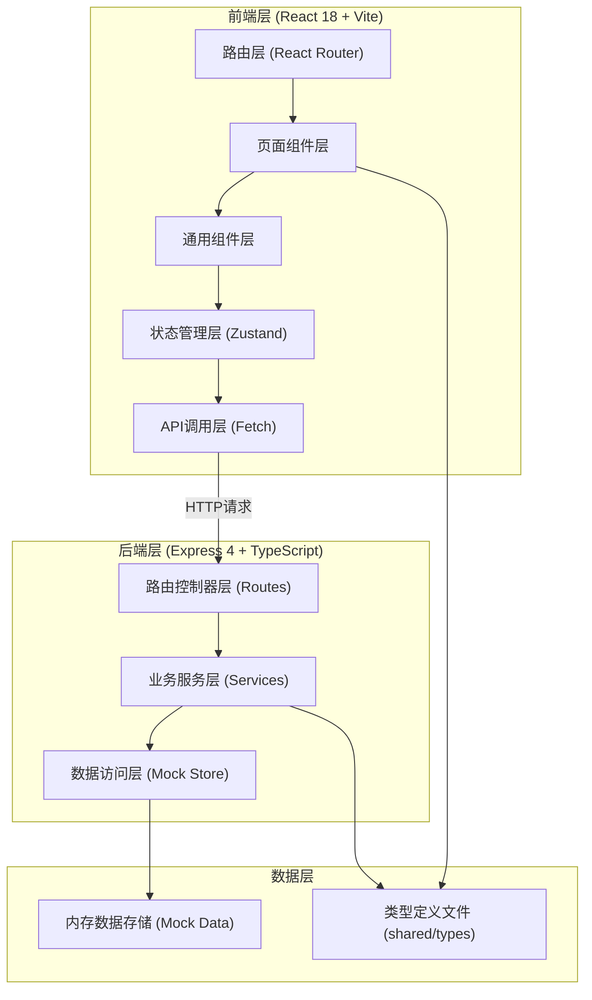
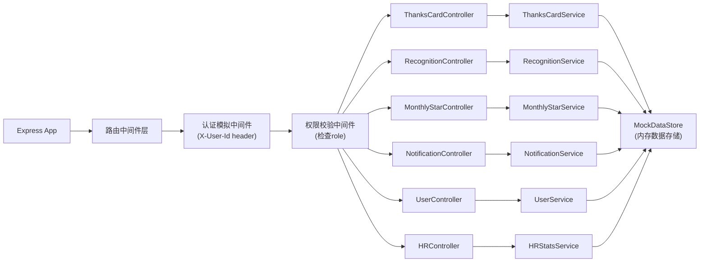
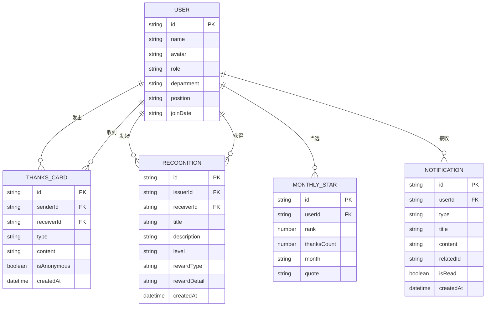

## 1. 架构设计



## 2. 技术说明

- **前端框架**: React@18 + TypeScript@5 + Vite@5
- **路由方案**: React Router DOM@6
- **状态管理**: Zustand@4 (轻量级store，管理用户登录、通知、筛选条件)
- **样式方案**: Tailwind CSS@3 + 自定义CSS变量 (香槟金主题)
- **图标方案**: Lucide React (统一金色主题图标)
- **初始化工具**: vite-init 脚手架
- **后端框架**: Express@4 + TypeScript@5 (ESM模块)
- **数据存储**: 内存Mock数据 + 本地持久化 (无真实数据库，数据保存在Node内存中)
- **通信方式**: 前后端通过RESTful API通信，Vite配置代理转发 /api 到 Express 服务

## 3. 路由定义

### 前端路由 (React Router)

| 路由路径 | 页面组件 | 页面说明 | 访问权限 |
|----------|---------|---------|---------|
| / | HomePage | 首页荣誉墙（月度之星+感谢卡瀑布流+表彰区） | 所有登录用户 |
| /send-thanks | SendThanksPage | 发送感谢卡页面 | 所有登录用户 |
| /recognition | RecognitionPage | 管理层发起正式表彰页面 | 仅管理层 |
| /profile/:userId | ProfilePage | 员工个人主页（成就本） | 所有登录用户 |
| /hr-analytics | HRAnalyticsPage | HR数据统计与绩效辅助 | 仅HR |
| /notifications | NotificationsPage | 通知中心页面 | 所有登录用户 |

### 后端API路由 (Express)

| 方法 | 路径 | 用途 |
|------|------|------|
| GET | /api/users | 获取所有员工列表 |
| GET | /api/users/:id | 获取员工详情 |
| GET | /api/thanks-cards | 获取感谢卡列表（支持筛选） |
| POST | /api/thanks-cards | 发送新感谢卡 |
| GET | /api/thanks-cards/:id | 获取感谢卡详情 |
| GET | /api/recognitions | 获取正式表彰列表 |
| POST | /api/recognitions | 发起正式表彰（管理层） |
| GET | /api/monthly-stars | 获取月度之星列表 |
| POST | /api/monthly-stars/calculate | 手动触发月度之星计算（调试用） |
| GET | /api/notifications | 获取当前用户通知列表 |
| POST | /api/notifications/:id/read | 标记通知已读 |
| POST | /api/notifications/read-all | 标记全部已读 |
| GET | /api/hr/stats | HR数据统计（贡献度、类型分布） |
| GET | /api/hr/quiet-contributors | HR识别不善表达的员工 |

## 4. API类型定义

```typescript
// ========== 共享类型定义 (shared/types/index.ts) ==========

export type UserRole = 'employee' | 'manager' | 'hr';

export type Department = '技术部' | '产品部' | '设计部' | '市场部' | '运营部' | '人力资源部';

export type ThanksType = '协作互助' | '解决难题' | '超越期待' | '导师指导' | '创新贡献';

export type RecognitionLevel = 'gold' | 'silver' | 'bronze';

export type RewardType = 'bonus' | 'gift' | 'both';

export interface User {
  id: string;
  name: string;
  avatar: string;
  role: UserRole;
  department: Department;
  position: string;
  joinDate: string;
  bio?: string;
}

export interface ThanksCard {
  id: string;
  senderId: string;
  receiverId: string;
  type: ThanksType;
  content: string;
  isAnonymous: boolean;
  createdAt: string;
}

export interface Recognition {
  id: string;
  issuerId: string;
  receiverId: string;
  title: string;
  description: string;
  level: RecognitionLevel;
  rewardType: RewardType;
  rewardDetail: string;
  createdAt: string;
}

export interface MonthlyStar {
  id: string;
  userId: string;
  rank: 1 | 2 | 3;
  thanksCount: number;
  month: string; // "YYYY-MM"
  quote: string;
}

export type NotificationType = 'thanks_received' | 'thanks_sent' | 'recognition_received' | 'recognition_broadcast' | 'monthly_star';

export interface Notification {
  id: string;
  userId: string;
  type: NotificationType;
  title: string;
  content: string;
  relatedId?: string;
  isRead: boolean;
  createdAt: string;
}

// ========== 请求响应类型 ==========

export interface SendThanksCardRequest {
  receiverId: string;
  type: ThanksType;
  content: string;
  isAnonymous: boolean;
}

export interface CreateRecognitionRequest {
  receiverId: string;
  title: string;
  description: string;
  level: RecognitionLevel;
  rewardType: RewardType;
  rewardDetail: string;
}

export interface HRStatsResponse {
  totalThanksCards: number;
  totalRecognitions: number;
  thanksByType: Record<ThanksType, number>;
  thanksByDepartment: Record<Department, number>;
  topContributors: Array<{ userId: string; received: number; sent: number }>;
  quietContributors: string[];
}
```

## 5. 服务端架构图



## 6. 数据模型

### 6.1 ER图



### 6.2 初始化Mock数据说明

系统启动时 MockDataStore 自动载入以下数据：
- **15名员工**：覆盖6个部门，包含3种角色（10名普通员工、3名管理层、2名HR）
- **35张感谢卡**：分布在最近30天，覆盖5种感谢类型，20%为匿名
- **5条正式表彰**：金银铜各级别，包含奖金和实物奖励场景
- **1组月度之星**：当月Top3自动计算生成
- **每位用户5-8条通知**：混合已读/未读状态
